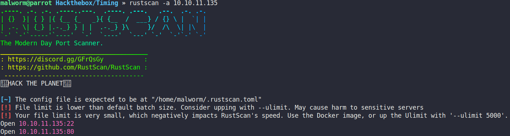

#### Scan

First did basic port scanning using Rustscan to find open ports.


```
malworm@parrot Hackthebox/Timing » nmap -p 22,80 -sCV 10.10.11.135
Starting Nmap 7.92 ( https://nmap.org ) at 2022-03-24 16:54 GMT
Nmap scan report for 10.10.11.135
Host is up (0.26s latency).

PORT   STATE SERVICE VERSION
22/tcp open  ssh     OpenSSH 7.6p1 Ubuntu 4ubuntu0.5 (Ubuntu Linux; protocol 2.0)
| ssh-hostkey: 
|   2048 d2:5c:40:d7:c9:fe:ff:a8:83:c3:6e:cd:60:11:d2:eb (RSA)
|   256 18:c9:f7:b9:27:36:a1:16:59:23:35:84:34:31:b3:ad (ECDSA)
|_  256 a2:2d:ee:db:4e:bf:f9:3f:8b:d4:cf:b4:12:d8:20:f2 (ED25519)
80/tcp open  http    Apache httpd 2.4.29 ((Ubuntu))
|_http-server-header: Apache/2.4.29 (Ubuntu)
| http-title: Simple WebApp
|_Requested resource was ./login.php
| http-cookie-flags: 
|   /: 
|     PHPSESSID: 
|_      httponly flag not set
Service Info: OS: Linux; CPE: cpe:/o:linux:linux_kernel

```

FUzzing

```
malworm@parrot Hackthebox/Timing » ffuf -w /usr/share/wordlists/dirb/common.txt -u http://timing.htb/FUZZ -fc 404

        /'___\  /'___\           /'___\       
       /\ \__/ /\ \__/  __  __  /\ \__/       
       \ \ ,__\\ \ ,__\/\ \/\ \ \ \ ,__\      
        \ \ \_/ \ \ \_/\ \ \_\ \ \ \ \_/      
         \ \_\   \ \_\  \ \____/  \ \_\       
          \/_/    \/_/   \/___/    \/_/       

       v1.3.1 Kali Exclusive <3
________________________________________________

 :: Method           : GET
 :: URL              : http://timing.htb/FUZZ
 :: Wordlist         : FUZZ: /usr/share/wordlists/dirb/common.txt
 :: Follow redirects : false
 :: Calibration      : false
 :: Timeout          : 10
 :: Threads          : 40
 :: Matcher          : Response status: 200,204,301,302,307,401,403,405
 :: Filter           : Response status: 404
________________________________________________

.htaccess               [Status: 403, Size: 275, Words: 20, Lines: 10]
.htpasswd               [Status: 403, Size: 275, Words: 20, Lines: 10]
.hta                    [Status: 403, Size: 275, Words: 20, Lines: 10]
                        [Status: 302, Size: 0, Words: 1, Lines: 1]
css                     [Status: 301, Size: 306, Words: 20, Lines: 10]
images                  [Status: 301, Size: 309, Words: 20, Lines: 10]
index.php               [Status: 302, Size: 0, Words: 1, Lines: 1]
js                      [Status: 301, Size: 305, Words: 20, Lines: 10]
server-status           [Status: 403, Size: 275, Words: 20, Lines: 10]
```
Next Scan

```
malworm@parrot Hackthebox/Timing » ffuf -w /usr/share/wordlists/SecLists/Discovery/Web-Content/raft-small-files.txt -u http://timing.htb/FUZZ -fc 404 

        /'___\  /'___\           /'___\       
       /\ \__/ /\ \__/  __  __  /\ \__/       
       \ \ ,__\\ \ ,__\/\ \/\ \ \ \ ,__\      
        \ \ \_/ \ \ \_/\ \ \_\ \ \ \ \_/      
         \ \_\   \ \_\  \ \____/  \ \_\       
          \/_/    \/_/   \/___/    \/_/       

       v1.3.1 Kali Exclusive <3
________________________________________________

 :: Method           : GET
 :: URL              : http://timing.htb/FUZZ
 :: Wordlist         : FUZZ: /usr/share/wordlists/SecLists/Discovery/Web-Content/raft-small-files.txt
 :: Follow redirects : false
 :: Calibration      : false
 :: Timeout          : 10
 :: Threads          : 40
 :: Matcher          : Response status: 200,204,301,302,307,401,403,405
 :: Filter           : Response status: 404
________________________________________________

header.php              [Status: 302, Size: 0, Words: 1, Lines: 1]
footer.php              [Status: 200, Size: 3937, Words: 1307, Lines: 116]
.htaccess               [Status: 403, Size: 275, Words: 20, Lines: 10]
logout.php              [Status: 302, Size: 0, Words: 1, Lines: 1]
index.php               [Status: 302, Size: 0, Words: 1, Lines: 1]
login.php               [Status: 200, Size: 5609, Words: 1755, Lines: 178]
.                       [Status: 302, Size: 0, Words: 1, Lines: 1]
upload.php              [Status: 302, Size: 0, Words: 1, Lines: 1]
.html                   [Status: 403, Size: 275, Words: 20, Lines: 10]
profile.php             [Status: 302, Size: 0, Words: 1, Lines: 1]
.php                    [Status: 403, Size: 275, Words: 20, Lines: 10]
image.php               [Status: 200, Size: 0, Words: 1, Lines: 1]
.htpasswd               [Status: 403, Size: 275, Words: 20, Lines: 10]
.htm                    [Status: 403, Size: 275, Words: 20, Lines: 10]
.htpasswds              [Status: 403, Size: 275, Words: 20, Lines: 10]
.htgroup                [Status: 403, Size: 275, Words: 20, Lines: 10]
wp-forum.phps           [Status: 403, Size: 275, Words: 20, Lines: 10]
.htaccess.bak           [Status: 403, Size: 275, Words: 20, Lines: 10]
.htuser                 [Status: 403, Size: 275, Words: 20, Lines: 10]
```

Found ```img``` query parameter in image.php file. On searching found [this](https://0xffsec.com/handbook/web-applications/file-inclusion-and-path-traversal/) blog. Using wrapper php LFI I was able to access files in the host system. 
From /etc/passwd found the username of user on the host system - ```aaron```.
Tried to access aaron's home directory but no success. Then after some random files, I thought to look into php files of the website. I first went through most interesting one in hope to find the password - ```login.php```. I found nothing on plain sight. On opening source code, there were commented sections, and first was which gave the key. 

```
<!--?php

include "header.php";

function createTimeChannel()
{
    sleep(1);
}

include "db_conn.php";

if (isset($_SESSION['userid'])){
    header('Location: ./index.php');
    die();
}


if (isset($_GET['login'])) {
    $username = $_POST['user'];
    $password = $_POST['password'];

    $statement = $pdo--->

```
It is referring to some ```db_conn.php``` file in the same directory. 
```
<!--?php
$pdo = new PDO('mysql:host=localhost;dbname=app', 'root', '4_V3Ry_l0000n9_p422w0rd');
-->
```
Image.php
```
<!--?php

function is_safe_include($text)
{
    $blacklist = array("php://input", "phar://", "zip://", "ftp://", "file://", "http://", "data://", "expect://", "https://", "../");

    foreach ($blacklist as $item) {
        if (strpos($text, $item) !== false) {
            return false;
        }
    }
    return substr($text, 0, 1) !== "/";

}

if (isset($_GET['img'])) {
    if (is_safe_include($_GET['img'])) {
        include($_GET['img']);
    } else {
        echo "Hacking attempt detected!";
    }
}
-->
```
upload.php
```
<!--?php
include("admin_auth_check.php");

$upload_dir = "images/uploads/";

if (!file_exists($upload_dir)) {
    mkdir($upload_dir, 0777, true);
}

$file_hash = uniqid();

$file_name = md5('$file_hash' . time()) . '_' . basename($_FILES["fileToUpload"]["name"]);
$target_file = $upload_dir . $file_name;
$error = "";
$imageFileType = strtolower(pathinfo($target_file, PATHINFO_EXTENSION));

if (isset($_POST["submit"])) {
    $check = getimagesize($_FILES["fileToUpload"]["tmp_name"]);
    if ($check === false) {
        $error = "Invalid file";
    }
}

// Check if file already exists
if (file_exists($target_file)) {
    $error = "Sorry, file already exists.";
}

if ($imageFileType != "jpg") {
    $error = "This extension is not allowed.";
}

if (empty($error)) {
    if (move_uploaded_file($_FILES["fileToUpload"]["tmp_name"], $target_file)) {
        echo "The file has been uploaded.";
    } else {
        echo "Error: There was an error uploading your file.";
    }
} else {
    echo "Error: " . $error;
}
?-->
```


